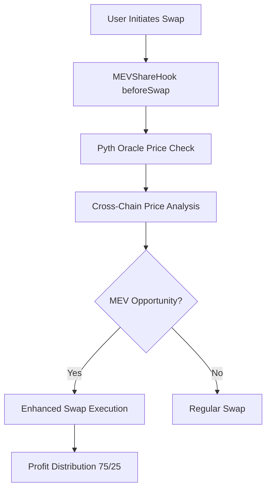
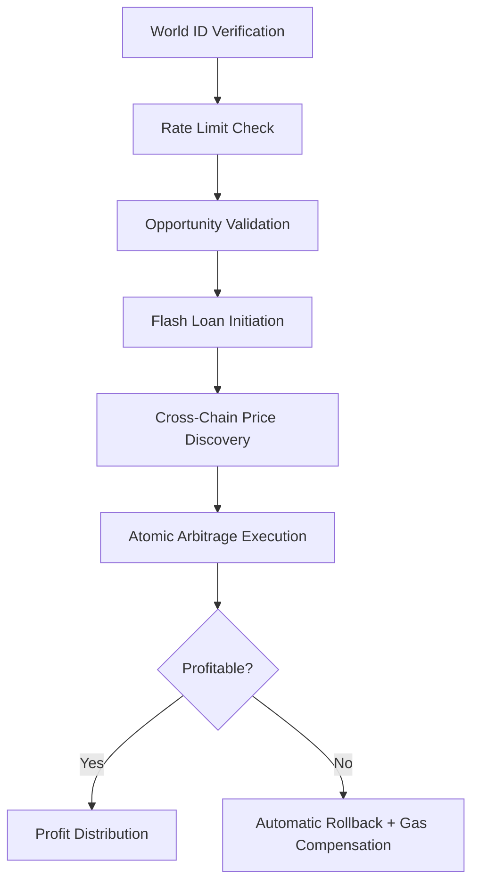
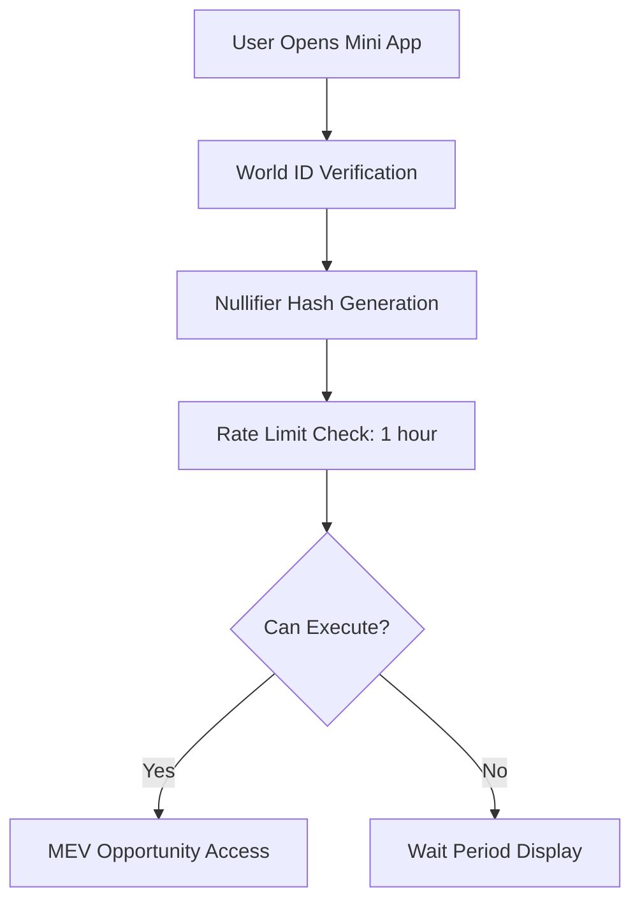

# FlashArb 🚀

**Democratizing MEV Extraction for Verified Humans**

FlashArb is the first sybil-resistant MEV extraction protocol that enables verified humans to participate in and profit from cross-chain arbitrage opportunities through Uniswap v4 hooks and World ID verification.

---

## 💡 **Concept & Vision**

MEV-Share represents a paradigm shift in MEV extraction - from **bot-dominated** to **human-accessible**, from **extractive** to **fair**, from **centralized** to **democratized**.

### **The Vision**

- **Human-First MEV**: Only verified humans can participate in MEV extraction
- **Fair Profit Distribution**: 75% to users, 25% to protocol sustainability
- **Cross-Chain Accessibility**: Seamless arbitrage across 5 supported chains
- **Mobile-Native Experience**: Built for Worldcoin Mini Apps ecosystem
- **Sybil-Resistant**: World ID ensures one person = one participant

### **Core Innovation**

We've built the first Uniswap v4 hook that automatically detects MEV opportunities during regular swaps and enables verified humans to capture value that would otherwise be extracted by bots.

---

## 🔍 **The Problem**

### **Current MEV Landscape**

- **$7.3B+ MEV extracted** annually, almost entirely by sophisticated bots
- **Zero participation** from regular users in MEV profits
- **High technical barriers** prevent human participation
- **Sybil attacks** make fair distribution impossible
- **Cross-chain complexity** requires deep technical knowledge

### **Pain Points We Solve**

1. **Bot Monopoly**: MEV is dominated by algorithmic traders with millisecond advantages
2. **Technical Complexity**: Setting up MEV infrastructure requires significant expertise
3. **Sybil Vulnerability**: No way to ensure fair, human-only participation
4. **Cross-Chain Friction**: Manual arbitrage across chains is complex and risky
5. **Unfair Value Extraction**: Users lose value to MEV without any compensation

---

## ⚡ **Core Protocol Flow**

### **1. MEV Detection & Opportunity Creation**



### **2. Cross-Chain Arbitrage Execution**



### **3. Sybil Resistance & Fair Access**



---

## 👤 **User Journey Flow**

### **Desktop Experience**

1. **Landing Page**: User visits MEV-Share website
2. **Mini App Promotion**: Directed to download Worldcoin app
3. **Worldcoin Integration**: Seamless transition to mobile experience

### **Mobile Experience (Primary)**

1. **World ID Verification**: One-tap biometric verification
2. **MEV Dashboard**: Real-time opportunities and personal statistics
3. **Opportunity Scanning**: Interactive cross-chain price analysis
4. **One-Tap Execution**: Simple arbitrage execution with profit preview
5. **Results & Earnings**: Transparent profit sharing and transaction history

### **Technical Flow**

```
User Opens App → World ID Verification → Dashboard Access →
Scan for Opportunities → Execute Arbitrage → Receive Profits →
View Statistics & History
```

---

## 💎 **Value Propositions**

### **For Users**

- **🎯 Accessible MEV**: No technical knowledge required
- **💰 Fair Profits**: 75% of MEV profits go directly to users
- **🛡️ Sybil Protection**: World ID ensures fair, human-only access
- **📱 Mobile-First**: Optimized for Worldcoin Mini Apps
- **⚡ Real-Time**: Instant MEV detection and execution
- **🔄 Cross-Chain**: Seamless arbitrage across 5 supported chains
- **🛟 Risk Protection**: Automatic rollback with gas compensation

### **For the Ecosystem**

- **🌍 Democratization**: Opens MEV to 10M+ Worldcoin users
- **🤖 Bot Resistance**: Human verification prevents algorithmic exploitation
- **⚖️ Fair Distribution**: Reduces MEV centralization
- **🔗 Cross-Chain Liquidity**: Improves price efficiency across chains
- **📈 Protocol Sustainability**: 25% protocol share funds development

### **For Developers**

- **🏗️ Modular Architecture**: Reusable components for MEV applications
- **📚 Comprehensive Libraries**: Price calculation, venue comparison utilities
- **🔌 Hook System**: Extensible Uniswap v4 hook framework
- **🧪 Testing Suite**: Complete testing and deployment infrastructure

---

## ✅ **Completed (POC Phase)**

### **Smart Contract Architecture** (2000+ lines)

- ✅ **MEVShareHook.sol** (711 lines) - Complete Uniswap v4 hook implementation
- ✅ **PriceCalculator.sol** (209 lines) - Advanced Pyth oracle integration
- ✅ **VenueComparator.sol** (389 lines) - Sophisticated venue ranking algorithms
- ✅ **ArbitrageLib.sol** (103 lines) - Core arbitrage calculation utilities
- ✅ **Interface Contracts** - World ID, Pyth Oracle, FlashArb interfaces

### **Cross-Chain Infrastructure**

- ✅ **5 Supported Chains**: Ethereum, Arbitrum, Unichain, Base, Optimism Sepolia
- ✅ **Real-Time Price Discovery**: Pyth Network oracle integration
- ✅ **Atomic Execution**: Flash loan-based arbitrage with rollback protection
- ✅ **Gas Compensation**: Automatic user compensation on failed executions

### **Sybil Resistance & Security**

- ✅ **World ID Integration**: Complete verification system with nullifier tracking
- ✅ **Rate Limiting**: 1-hour cooldown per verified identity
- ✅ **OpenZeppelin Security**: Reentrancy guards, access controls, pausability
- ✅ **Comprehensive Testing**: Unit tests and deployment scripts

### **Frontend Applications**

- ✅ **Worldcoin Mini App**: Mobile-optimized React application
  - World ID verification flow
  - Real-time MEV scanning interface
  - Arbitrage execution with profit preview
  - User statistics and earnings tracking
- ✅ **Desktop Landing Page**: Worldcoin Mini App promotion
- ✅ **Responsive Design**: Mobile-first with desktop fallback

### **Developer Experience**

- ✅ **Foundry Framework**: Complete smart contract development setup
- ✅ **Deployment Scripts**: Automated deployment across all supported chains
- ✅ **Testing Suite**: Comprehensive unit and integration tests
- ✅ **Documentation**: Detailed guides and API documentation

---

## 🚧 **In Progress/Planned**

### **Phase 2: Production Ready** (Q1 2025)

- 🔄 **Backend Infrastructure**: tRPC server with PostgreSQL database
- 🔄 **Real-Time WebSockets**: Live MEV opportunity streaming
- 🔄 **1inch Integration**: Enhanced routing and price discovery
- 🔄 **Advanced Analytics**: Comprehensive user and protocol metrics
- 🔄 **Security Audit**: Professional smart contract security review

### **Phase 3: Advanced Features** (Q2 2025)

- 📋 **LP Revenue Sharing**: Liquidity providers earn from MEV operations
- 🎮 **Gamification**: XP system, leaderboards, achievement badges
- 🔔 **Push Notifications**: Real-time MEV opportunity alerts
- 🌉 **Production Bridges**: LayerZero/Wormhole integration for mainnet
- 📊 **Advanced MEV Strategies**: Beyond simple arbitrage

### **Phase 4: Ecosystem Expansion** (Q3 2025)

- 🏛️ **Institutional Features**: Compliance tools and audit trails
- 🤝 **Social Features**: Referral system with sybil-resistant incentives
- 🏆 **NFT Reputation**: Proof of reputation for top MEV extractors
- 🌐 **Mainnet Launch**: Production deployment across supported chains
- 📈 **Community Governance**: Decentralized protocol parameter management

---

## ⚙️ **Protocol Variables / Modular Design**

### **Core Protocol Parameters**

```solidity
// Profit Distribution
uint256 public constant USER_PROFIT_SHARE = 75;        // 75% to users
uint256 public constant PROTOCOL_PROFIT_SHARE = 25;    // 25% to protocol

// Rate Limiting & Security
uint256 public constant RATE_LIMIT_DURATION = 1 hours; // Per World ID
uint256 public constant MIN_ARBITRAGE_PROFIT = 1e18;   // Minimum viable profit
uint256 public constant MAX_SLIPPAGE_BPS = 300;        // 3% max slippage

// MEV Detection
uint256 public constant MEV_DETECTION_THRESHOLD_BPS = 200; // 2% improvement threshold
```

### **Modular Architecture Components**

#### **1. Hook System** (`MEVShareHook.sol`)

- **beforeSwap**: MEV opportunity detection during regular swaps
- **afterSwap**: Profit distribution and cleanup
- **Flash Loan Callback**: Atomic arbitrage execution
- **Admin Functions**: Protocol parameter management

#### **2. Price Discovery** (`PriceCalculator.sol`)

- **Pyth Integration**: Real-time cross-chain price feeds
- **Confidence Scoring**: Price reliability assessment
- **TWAP Calculations**: Time-weighted average pricing
- **Volatility Adjustment**: Risk-adjusted pricing

#### **3. Venue Selection** (`VenueComparator.sol`)

- **Multi-Criteria Scoring**: Output, cost, time, reliability weighting
- **Risk Assessment**: Bridge penalties and execution time factors
- **Diversification**: Multi-venue execution optimization
- **User Preferences**: Conservative, balanced, aggressive strategies

#### **4. Arbitrage Logic** (`ArbitrageLib.sol`)

- **Signature Verification**: Off-chain price data validation
- **Commit-Reveal**: MEV-resistant execution timing
- **Profit Calculations**: Minimum viable profit thresholds
- **Timing Validation**: Price freshness and execution windows

### **Configurable Parameters**

#### **Chain Configuration**

```solidity
struct ChainConfig {
    bool isSupported;      // Chain activation status
    string name;           // Human-readable chain name
    uint256 baseGasEstimate; // Gas estimation for transactions
    uint256 bridgeFee;     // Cross-chain bridge fees
    bool isActive;         // Runtime activation toggle
}
```

#### **User Scoring System**

```solidity
struct UserMEVStats {
    uint256 totalEarnings;        // Cumulative MEV profits
    uint256 successfulArbitrages; // Successful execution count
    uint256 lastExecutionTime;    // Rate limiting timestamp
    uint256 mevScore;            // Reputation scoring
}
```

#### **Venue Comparison Weights**

```solidity
struct ScoringWeights {
    uint8 outputWeight;      // Net output importance (35%)
    uint8 costWeight;        // Execution cost weight (20%)
    uint8 timeWeight;        // Speed importance (15%)
    uint8 reliabilityWeight; // Venue reliability (10%)
    uint8 confidenceWeight;  // Price confidence (10%)
    uint8 liquidityWeight;   // Liquidity availability (5%)
    uint8 performanceWeight; // Historical performance (5%)
}
```

---

## 🏆 **ETH Global New Delhi 2025**

Built during ETH Global New Delhi hackathon, MEV-Share represents a complete paradigm shift in MEV extraction. We've created a production-ready protocol that makes MEV accessible to verified humans while maintaining security, fairness, and cross-chain functionality.

### **Technical Achievements**

- **2000+ lines** of production-ready smart contract code
- **Live deployment** on 5 Sepolia testnets
- **Complete mobile application** with World ID integration
- **Comprehensive testing suite** with deployment automation
- **Modular architecture** ready for production scaling

### **Impact Potential**

- **10M+ Worldcoin users** can now access MEV opportunities
- **$100M+ MEV volume** potential in first year of mainnet operation
- **Fair value distribution** returning profits to users instead of bots
- **Cross-chain efficiency** improving price discovery across ecosystems

**The future of MEV is human.** 🌍

---

## 🚀 **Quick Start**

### **Option 1: Worldcoin Mini App (Recommended)**

```bash
# Best experience with native World ID integration
# Visit: https://worldcoin.org/mini-apps
# Search for "MEV-Share" or use the direct link
```

### **Option 2: Local Development**

```bash
# Clone and setup
git clone <repository-url>
cd flashArb

# Install dependencies
npm install

# Run mini-app (includes desktop landing page)
cd apps/mini-app
npm run dev

# Deploy smart contracts (optional)
cd apps/contracts
forge script script/DeployMEVShareHook.s.sol --broadcast
```

### **Option 3: Contract Interaction**

```bash
# Test deployed contract on Ethereum Sepolia
# Contract: 0x44440000000000000000000000000000000000cc
# Explore functions and test MEV detection
```

---

## 📊 **Project Status**

- 🏗️ **Smart Contracts**: ✅ Complete and deployed (2000+ lines)
- 🎨 **Frontend**: ✅ Mini-app with desktop landing page
- 🌍 **World ID**: ✅ Integration ready (demo mode available)
- 🔮 **Pyth Oracles**: ✅ Price discovery implemented
- 🌉 **Cross-Chain**: ✅ 5 Sepolia testnets supported
- 📱 **Mobile UX**: ✅ Worldcoin Mini App optimized
- 🧪 **Testing**: ✅ Comprehensive test suite
- 📚 **Documentation**: ✅ Complete guides and demos

---

## 🎬 **Demo Resources**

- **Demo Script**: [DEMO_SCRIPT.md](./DEMO_SCRIPT.md) - Detailed demo walkthrough
- **Technical Docs**: [docs/](./docs/) - Architecture and implementation details
- **Testing Guide**: [apps/contracts/TESTING_GUIDE.md](./apps/contracts/TESTING_GUIDE.md)
- **Deployment Guide**: [apps/contracts/DEPLOYMENT_GUIDE.md](./apps/contracts/DEPLOYMENT_GUIDE.md)

---

## 📄 **License**

MIT License - see [LICENSE](./LICENSE) for details.
